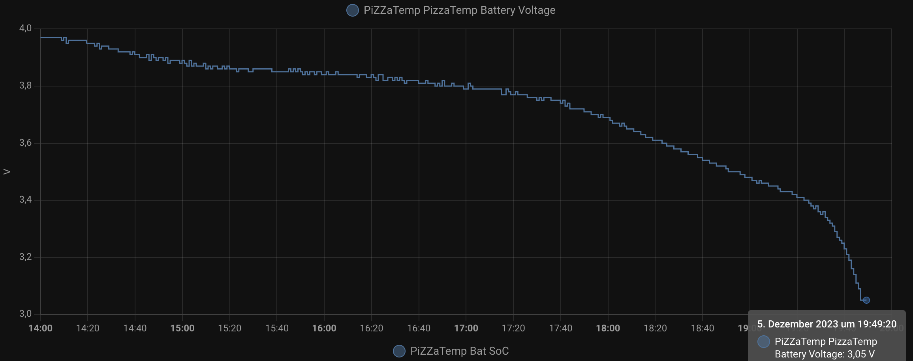
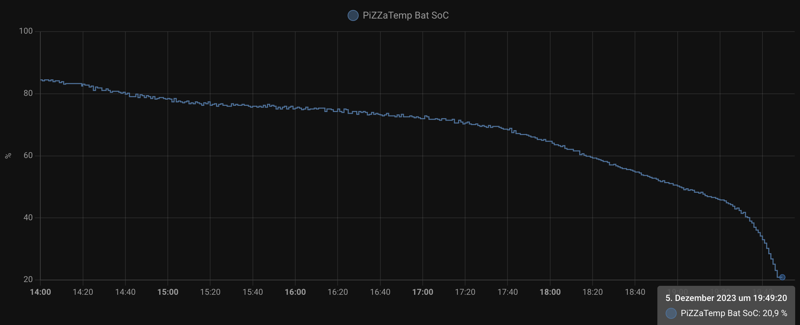

# 🍕 PIZZATemp 🍕

🚧 Under Construction 🚧

Hi 👋 I am a german amateur Pizzaiolo  🤌  loving to bake Pizza in my Ooni oven. 

Within this repo I am providing everything you will need to build your own high temperature (±450°C) thermometer for your smart home (based on Home Assistant and ESPHome). 

Usecase:
I am heating up my Ooni Koda 16 on the balcony and dont want to leave the house checking the temperature manually (...its winter in Germany...) - but i also want to see the temperature when i am outside without a mobile/tablet, so I included a 1.3" OLED display.
Reaching different temperature thresholds I get notified via Home Assistant to my smart phone. 

to be documented:
- 3d Housing Deckel
- Regel für Benachrichtigung SoC unter 30%
- link sensor
- link amp
- Zeit Laden
- Zeit Entladen im Betrieb
- add pics from device
- pic from temp curve
- code for notification

## Part list:
Part Name  | Link/Info | Price
------------- | -------------
Batteryshield for Wemos D1 Mini v1.1.0 (from Ali) | not availabe anymore | 3€
100k Ohm Resistor   | use any | -
Wemos D1 Mini | use any | 
OLED Display 1.3"    | https://de.aliexpress.com/item/1005005967766159.html | 
3D Print Housing | Add link | -
Amplifier | https://paradisetronic.com/products/adafruit-verstaerker-pt1000-widerstandsthermometer-max31865?_pos=1&_sid=f3c75bd0b&_ss=r Adafruit Verstärker für PT1000 Widerstandsthermometer, MAX31865, 3648 × 1 | 21€
Temperature Sensor | Add link | 16€
Jumper cable  | https://de.aliexpress.com/item/1005005616437142.html | -
LiPo  | https://de.aliexpress.com/item/1005003198563309.html | 10€
Toggle switch   | use any | -

## Short (and unsorted) Documentation
----------------------------------------------------------------------------------
To set the threshold for a SoC Notification I collected some Data running the device until the battery shield's discharge protection turned off the device.

Battery Voltage:

Battery SoC:

----------------------------------------------------------------------------------
Berechnung Faktor für Analogwandlung inkl Spannungsteiler:

Spannungswert mit Faktor 1: 0,07 V
Real gemessene Spannung: 0,272 V

Faktor = 0,272/0,07 = 3,886

Korrektur 1:

Spannungswert mit Faktor 3,886: 3.76V
Real gemessene SPannung= 4,06V

Faktor neu = Faktor * (4,06/3,886)= 4.19614

----------------------------------------------------------------------------------

How to ESPHome

- Update cli:
    - `pip3 install -U esphome`
- Build bin:
	- `esphome compile YOURYAML.yaml`
- Flashing via CLI:
    - `esphome upload --device /dev/cu.usbserial-0257B058 pizzatemp.yaml`
- Build and Flashing OTA:
    - `esphome run YOURYAML.yaml --device 192.168.178.28`
----------------------------------------------------------------------------------
How to calc SoC (kept really really simple and linear for the complete curve...):

4.2V = 100%

2.75V = 0%

Prozentskala=(Wert−Untere Grenze) / (Obere Grenze−Untere Grenze)×100

percent = (x-2.75)/(4.2-2.75)*100

If you are a lipo expert and do have a more accurate way to calc SoC (which can be done on the D1Mini) - feel free to reach out.

----------------------------------------------------------------------------------

Source Reference:

* Batteryshield Infos:
https://iotspace.dev/wemos-d1-mini-battery-shield/

* Spannungsteiler Info:
https://www.nikolaus-lueneburg.de/2016/12/spannungsteiler/

* Analogwerte mit ESPHome einlesen:
https://esphome.io/components/sensor/adc.html
* Info LiPo Akku:
https://www.lithium-polymer-akkus.de/wiederaufladbarer-lipo-akku-lp053450-3-7-v-900-mah-3-33wh/
Entladungsabschaltung: 2,75 V
Max. Ladespannung: 4,2 V ± 50 mV